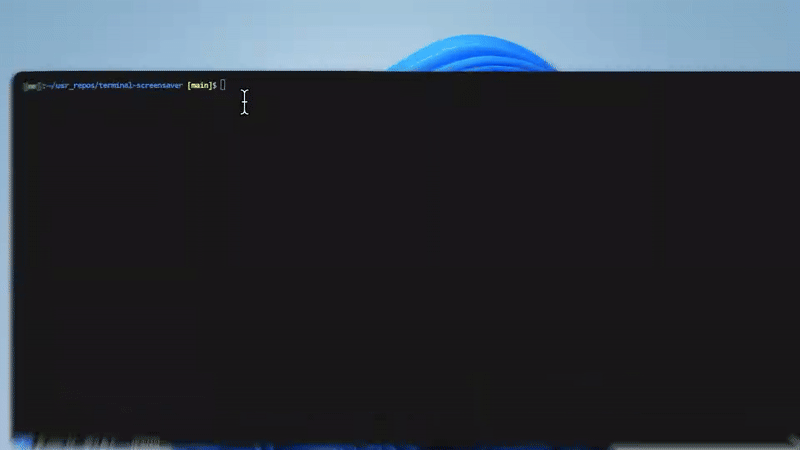

# Terminal Screensaver

A dynamic terminal screen saver crate with plugin architecture that automatically resizes with any screen size.

## Demo

<div style="border-radius: 8px; overflow: hidden; display: inline-block;">
    
</div>

## Features

- **Dynamic Sizing**: Automatically adapts to any terminal size
- **Script Integration**: Execute any script or command with custom keyboard shortcuts
- **Plugin Architecture**: Extensible event handling for custom actions
- **TOML Configuration**: Easy customization without code changes
- **Cross-platform**: Works on Windows, Linux, and macOS
- **Library & Binary**: Use as a library or standalone application
- **Interactive Help Display**: Built-in help panel with keyboard shortcuts

For detailed feature documentation, see **[Features Guide](docs/features.md)**.

## Quick Start

### Installation & Usage

```bash
# Clone and build
git clone https://github.com/BA-CalderonMorales/terminal-screensaver.git
cd terminal-screensaver
cargo build --release

# Run with demo configuration
./target/release/terminal-screensaver -c demo-config.toml
```

For comprehensive setup instructions, see **[Quick Start Guide](docs/quick-start.md)**.

## Configuration

Basic configuration example:

```toml
text = "My Terminal Screensaver"
style = "default"

[[actions]]
key = "h"
description = "Say Hello"
command = "./scripts/hello.sh"
```

For complete configuration documentation, see **[Configuration Guide](docs/configuration.md)**.

## Controls

| Key | Action |
|-----|--------|
| `ESC` | Exit screensaver |
| `ENTER` | Show action menu |
| `a-z, 0-9, symbols` | Execute configured actions |

For detailed control information, see **[Controls & Keyboard Shortcuts](docs/controls.md)**.

## Documentation

| Document | Description |
|----------|-------------|
| **[Quick Start](docs/quick-start.md)** | Installation, basic usage, and first steps |
| **[Features](docs/features.md)** | Complete feature overview and capabilities |  
| **[Configuration](docs/configuration.md)** | Comprehensive configuration guide and examples |
| **[Controls](docs/controls.md)** | Keyboard shortcuts and control reference |
| **[Architecture](docs/architecture.md)** | Technical architecture and design principles |
| **[Roadmap](docs/roadmap.md)** | Future features and development timeline |
| **[Testing](docs/testing.md)** | Testing strategies and guidelines |
| **[Security](docs/security.md)** | Security considerations and best practices |
| **[CLI](docs/cli.md)** | Command-line interface documentation |
| **[Backend](docs/backend.md)** | Backend development guide |
| **[Frontend](docs/frontend.md)** | Frontend and styling guide |
| **[CI/CD](docs/cicd.md)** | Continuous integration and deployment |
| **[Documentation](docs/documentation.md)** | Documentation standards and guidelines |

## Support the Project

If Terminal Screensaver has been helpful for your development workflow or you appreciate the plugin architecture approach, consider supporting the project:

[](https://www.buymeacoffee.com/brandoncalderonmorales)

Your support helps maintain and improve Terminal Screensaver for the entire community!

## License

Licensed under MIT license.
