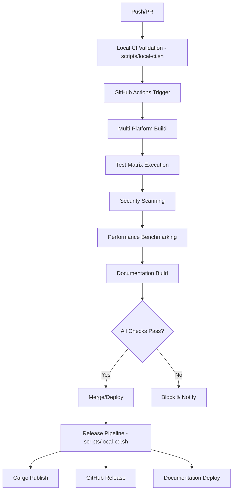

# CI/CD Pipeline Documentation

## Pipeline Philosophy

The terminal screensaver project implements a robust CI/CD pipeline that emphasizes quality, security, and reliability. The core principle is **local-first development**: the same script (`local-ci.sh`) that developers run locally is executed in the CI environment, ensuring identical feedback and reducing CI surprises.

## Pipeline Architecture

### Scripts Organization
All automation scripts are organized in the `scripts/cicd/` directory for better maintainability:

```
scripts/cicd/
├── local-ci.sh         # Local Continuous Integration pipeline
└── local-cd.sh         # Local Continuous Deployment pipeline
```

### GitHub Actions Integration
Our `.github/workflows/ci.yml` implements a streamlined pipeline based on the `local-ci.sh` script:

```
cargo_check (base compilation check)
├── local_ci (runs our local-ci.sh script)
├── rustfmt (formatting check) 
├── clippy (linting)
└── test (cross-platform testing)
    └── github_build (release builds, only on tags)
        └── github_release (create releases)

cargo_audit (runs independently for security)
```

### Local Development Pipeline
The foundation of our CI/CD strategy begins with local development tooling:

```bash
# Local CI script - comprehensive quality gates
./scripts/local-ci.sh [--skip-tests] [--skip-audit] [--help]
```

### Local Deployment Pipeline
For release management and crate publishing:

```bash
# Local CD script - release management
./scripts/local-cd.sh [--version VERSION] [--dry-run] [--help]
```

#### Local CI Stages
1. **Environment Verification**: Rust toolchain validation
2. **Code Quality**: Formatting and linting
3. **Build Verification**: Debug and release builds
4. **Testing Suite**: Unit, integration, and performance tests
5. **Security Audit**: Dependency vulnerability scanning
6. **Documentation**: Doc generation and validation

#### Local CD Stages
1. **Pre-flight Checks**: Git repository validation and clean working directory
2. **CI Pipeline**: Runs complete local-ci.sh pipeline
3. **Version Management**: Updates Cargo.toml and version constants
4. **Package Verification**: Cargo package dry run and content review
5. **Crates.io Validation**: Checks if version already exists
6. **Git Operations**: Commits version changes and creates tags
7. **Publication**: Publishes to crates.io with verification
8. **Post-release**: Generates release notes and pushes to repository

**Local CD Usage Examples:**
```bash
# Test release process without publishing
./scripts/local-cd.sh --version 0.0.1 --dry-run

# Release version 0.0.1 to crates.io
./scripts/local-cd.sh --version 0.0.1

# Get help with CD options
./scripts/local-cd.sh --help
```

### Repository CI/CD Flow

The CI/CD pipeline builds upon the local scripts foundation:



**Integration with Local Scripts:**
- GitHub Actions workflows can invoke `scripts/local-ci.sh` for consistency
- Release workflows can leverage `scripts/local-cd.sh` logic
- Local and CI environments maintain parity

## GitHub Actions Workflows

### Pull Request Workflow
**File**: `.github/workflows/pr.yml`

#### Matrix Strategy
```yaml
strategy:
  matrix:
    os: [ubuntu-latest, windows-latest, macos-latest]
    rust-version: [stable, beta]
    include:
      - os: ubuntu-latest
        rust-version: nightly
        experimental: true
```

#### Workflow Steps
1. **Checkout & Setup**
   - Repository checkout
   - Rust toolchain installation
   - Dependency caching

2. **Code Quality Gates**
   - Format checking (`cargo fmt --check`)
   - Clippy linting (`cargo clippy -- -D warnings`)
   - Security audit (`cargo audit`)

3. **Build Verification**
   - Debug build compilation
   - Release build compilation
   - Feature flag combinations

4. **Testing Matrix**
   - Unit tests (`cargo test --lib`)
   - Integration tests (`cargo test --test '*'`)
   - Documentation tests (`cargo test --doc`)
   - Performance benchmarks

5. **Compatibility Testing**
   - Multiple Rust versions
   - Cross-platform validation
   - Terminal compatibility matrix

### Main Branch Workflow
**File**: `.github/workflows/main.yml`

Extended pipeline for main branch commits:
- Full compatibility matrix
- Extended performance testing
- Security penetration testing
- Documentation deployment

### Release Workflow
**File**: `.github/workflows/release.yml`

Automated release pipeline:
- Version validation
- Changelog generation
- Cargo crate publishing
- GitHub release creation
- Documentation updates

### Crate Publishing Process

#### Prerequisites for Publishing
1. **Crates.io Token**: Configure authentication token in `.env` or environment
2. **Git Repository**: Clean working directory on main branch (or specified branch)
3. **CI Validation**: All local-ci.sh checks must pass
4. **Version Increment**: Semantic versioning (MAJOR.MINOR.PATCH)

#### Publishing Workflow
```bash
# 1. Run local CI to ensure quality
./scripts/local-ci.sh

# 2. Test release process (recommended)
./scripts/local-cd.sh --version 0.0.1 --dry-run

# 3. Publish to crates.io
./scripts/local-cd.sh --version 0.0.1
```

#### Version Management
The local-cd.sh script handles:
- **Cargo.toml**: Updates version field
- **src/lib.rs**: Updates VERSION constant (if present)
- **Git Tags**: Creates annotated version tags
- **Commit History**: Maintains clean version history

#### Post-Publication Verification
- **Crates.io API**: Validates successful publication
- **Documentation**: Verifies docs.rs generation
- **Download Test**: Confirms installability via `cargo install`

### Cargo Configuration
**File**: `.cargo/config.toml`

```toml
[build]
target-dir = "target"

[cargo-new]
vcs = "git"

[net]
retry = 3

[profile.release]
lto = true
codegen-units = 1
panic = 'abort'
strip = true

[profile.dev]
debug = true
overflow-checks = true
```

### Cross-Compilation Support
```yaml
# GitHub Actions matrix for multiple targets
target:
  - x86_64-unknown-linux-gnu
  - x86_64-pc-windows-msvc
  - x86_64-apple-darwin
  - aarch64-apple-darwin
  - x86_64-unknown-linux-musl
```

## Quality Gates

### Code Quality Requirements

#### Formatting Standards
- **Rustfmt**: Enforced formatting with custom configuration
- **Line Length**: Maximum 100 characters
- **Import Organization**: Alphabetical with grouping
- **Code Style**: Consistent with project standards

```toml
# rustfmt.toml
max_width = 100
hard_tabs = false
tab_spaces = 4
edition = "2021"
group_imports = "StdExternalCrate"
```

#### Linting Requirements
- **Clippy**: All warnings treated as errors
- **Custom Lints**: Project-specific lint configuration
- **Documentation**: All public APIs documented
- **Security Lints**: Security-focused lint rules

```toml
# Clippy configuration
[lints.clippy]
all = "warn"
pedantic = "warn"
cargo = "warn"
security = "deny"
```

### Testing Requirements

#### Coverage Thresholds
- **Unit Tests**: Minimum 90% line coverage
- **Integration Tests**: All CLI commands covered
- **Security Tests**: All security-critical paths tested
- **Performance Tests**: Benchmark regression detection

#### Test Categories
```bash
# Fast tests (< 5 seconds)
cargo test --lib

# Integration tests (< 30 seconds) 
cargo test --test '*'

# Slow tests (benchmarks, compatibility)
cargo test --release --features slow-tests
```

### Security Requirements

#### Dependency Auditing
- **Cargo Audit**: No known vulnerabilities
- **License Compliance**: Compatible license verification
- **Supply Chain**: Dependency provenance validation
- **SBOM Generation**: Software Bill of Materials creation

#### Security Scanning
```yaml
- name: Security Audit
  run: |
    cargo audit --deny warnings
    cargo audit --json > audit-report.json
    
- name: Dependency Check
  uses: actions/upload-artifact@v3
  with:
    name: security-reports
    path: audit-report.json
```

## Performance Monitoring

### Benchmark Automation
**Location**: `benches/`

Automated performance regression detection:
- Rendering performance benchmarks
- Memory usage monitoring
- CPU utilization measurement
- Startup time validation

```rust
// Example benchmark
fn criterion_benchmark(c: &mut Criterion) {
    c.bench_function("screensaver_render_large", |b| {
        let screensaver = create_test_screensaver();
        b.iter(|| screensaver.render_frame())
    });
}
```

### Performance Regression Detection
- Baseline performance metrics stored
- Automatic regression detection
- Performance trend analysis
- Alert system for significant degradation

## Artifact Management

### Build Artifacts
- **Debug Binaries**: Development and testing
- **Release Binaries**: Production deployment
- **Documentation**: Generated API docs
- **Coverage Reports**: Test coverage analysis

### Release Artifacts
```yaml
- name: Create Release Artifacts
  run: |
    cargo build --release --target x86_64-unknown-linux-gnu
    cargo build --release --target x86_64-pc-windows-msvc
    cargo build --release --target x86_64-apple-darwin
    
- name: Package Artifacts
  run: |
    mkdir -p release/
    cp target/x86_64-unknown-linux-gnu/release/terminal-screensaver release/terminal-screensaver-linux
    cp target/x86_64-pc-windows-msvc/release/terminal-screensaver.exe release/terminal-screensaver-windows.exe
    cp target/x86_64-apple-darwin/release/terminal-screensaver release/terminal-screensaver-macos
```

## Deployment Pipeline

### Cargo Crate Publishing
Automated publishing to crates.io:

```yaml
- name: Publish to Crates.io
  if: startsWith(github.ref, 'refs/tags/v')
  run: |
    cargo login ${{ secrets.CARGO_TOKEN }}
    cargo publish --dry-run
    cargo publish
```

### GitHub Release Creation
Automated release management:
- Git tag-triggered releases
- Changelog generation from commits
- Binary attachment to releases
- Release notes automation

### Documentation Deployment
Automated documentation updates:
- API documentation to GitHub Pages
- README and guide updates
- Integration examples
- Migration guides for breaking changes

## Environment Management

### Development Environment
- **Local Development**: `./local-ci.sh` integration
- **Feature Branches**: Basic CI validation
- **Pull Requests**: Full CI/CD pipeline

### Staging Environment
- **Integration Testing**: Full compatibility matrix
- **Performance Testing**: Benchmark validation
- **Security Testing**: Penetration testing
- **User Acceptance Testing**: Manual validation

### Production Environment
- **Crates.io**: Package registry
- **GitHub Releases**: Binary distribution
- **Documentation Sites**: User guides and API docs
- **Monitoring**: Usage analytics and error tracking

## Secrets Management

### GitHub Secrets
Required secrets for CI/CD pipeline:
- `CARGO_TOKEN`: Crates.io publishing
- `GITHUB_TOKEN`: Release creation (automatic)
- `CODECOV_TOKEN`: Coverage reporting (optional)

### Security Practices
- **Least Privilege**: Minimal required permissions
- **Secret Rotation**: Regular credential updates
- **Audit Logging**: All secret usage logged
- **Access Control**: Team-based access management

## Monitoring and Alerting

### Pipeline Monitoring
- **Build Success Rate**: Track build reliability
- **Test Failure Analysis**: Identify flaky tests
- **Performance Trends**: Monitor benchmark results
- **Security Alerts**: Vulnerability notifications

### Notification Channels
- **GitHub**: Pull request status checks
- **Email**: Release notifications
- **Slack/Discord**: Team notifications (if configured)
- **Issue Creation**: Automated issue creation for failures

## Rollback and Recovery

### Rollback Procedures
- **Crate Yanking**: Emergency crate withdrawal
- **Version Rollback**: Previous version promotion
- **Hotfix Pipeline**: Expedited fix deployment
- **Communication Plan**: User notification strategy

### Recovery Testing
- **Disaster Recovery**: Pipeline reconstruction
- **Data Recovery**: Artifact and history restoration
- **Failover Testing**: Backup system validation
- **Recovery Time**: RTO/RPO measurements

## Pipeline Optimization

### Build Optimization
- **Dependency Caching**: Reduce build times
- **Incremental Builds**: Only rebuild changed components
- **Parallel Execution**: Matrix job optimization
- **Resource Management**: Efficient CI resource usage

### Test Optimization
- **Test Parallelization**: Faster test execution
- **Smart Test Selection**: Run only affected tests
- **Test Sharding**: Distribute tests across runners
- **Flaky Test Management**: Automatic retry and tracking

## Compliance and Governance

### Audit Requirements
- **Build Reproducibility**: Deterministic builds
- **Audit Trail**: Complete pipeline history
- **Compliance Reporting**: Automated compliance checks
- **Change Management**: Controlled pipeline modifications

### Documentation Requirements
- **Pipeline Documentation**: This document maintenance
- **Runbook Creation**: Operational procedures
- **Troubleshooting Guides**: Common issue resolution
- **Architecture Decision Records**: Pipeline evolution tracking

## Future Pipeline Enhancements

### Planned Improvements
- **Advanced Security Scanning**: SAST/DAST integration
- **Automated Dependency Updates**: Dependabot configuration
- **Advanced Analytics**: Pipeline metrics dashboard
- **Multi-Cloud Deployment**: Distribution across platforms

### Technology Roadmap
- **Container Integration**: Docker-based builds
- **Kubernetes Deployment**: Container orchestration
- **Cloud Native Tools**: Modern CI/CD tooling
- **AI-Assisted Testing**: Intelligent test generation